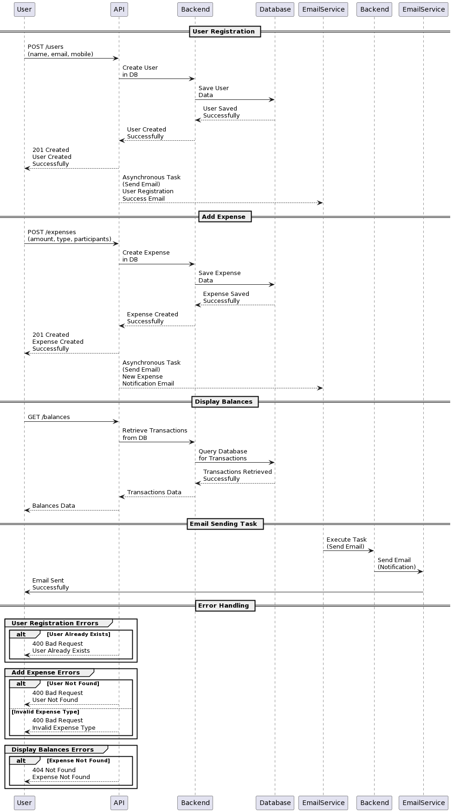

# Splitwise - An Expense Sharing App

## Application Overview

Splitwise App is a backend application designed to facilitate expense sharing among users. Users can add their expenses, split them among different people, and keep track of balances. The application supports various types of expenses, including EQUAL, EXACT, and PERCENT. It ensures accurate splitting of expenses and provides functionalities for viewing balances, simplifying expenses, and sending email notifications for expense updates.

## Workflow Diagram



## API Contracts

### User Registration

- **Method:** `POST`
- **Endpoint:** `/users`
- **Parameters:**
  - `name`: string
  - `email`: string
  - `mobile`: string
- **Response:** `201 Created` with user creation confirmation

### Add Expense

- **Method:** `POST`
- **Endpoint:** `/expenses`
- **Parameters:**
  - `amount`: float
  - `type`: string (EQUAL, EXACT, PERCENT)
  - `participants`: list of user IDs and shares
- **Response:** `201 Created` with expense creation confirmation

### Display Balances

- **Method:** `GET`
- **Endpoint:** `/balances`
- **Response:** Balances data for the user

### Email Sending Task

- **Description:** Asynchronous task to send email notifications for expense updates

## Class Structure
    controller/
    - balances.py
    - expense.py
    - users.py
    db/
    - connection.py
    - models.py
    exceptions/
    - expense_exceptions.py
    - user_exceptions.py
    main.py
    models/
    - request.py
    - response.py
    schedulers/
    - send_email.py
    service/
    - helpers.py

## Working of the Application

1. Users can register using the `/users` endpoint by providing their name, email, and mobile number.
2. Expenses can be added using the `/expenses` endpoint by specifying the amount, type, and participants.
3. Balances can be viewed using the `/balances` endpoint, which provides balances data for the user.
4. Email notifications are sent asynchronously for expense updates, and a scheduled job sends weekly emails containing the total amount owed by each user.

## Database Schema

```sql
CREATE TABLE users (
    user_id INTEGER PRIMARY KEY AUTOINCREMENT,
    name TEXT NOT NULL,
    email TEXT UNIQUE NOT NULL,
    mobile_number TEXT NOT NULL
);

CREATE TABLE expenses (
    expense_id INTEGER PRIMARY KEY AUTOINCREMENT,
    name TEXT NOT NULL,
    user_id INTEGER NOT NULL,
    amount FLOAT NOT NULL,
    expense_type TEXT NOT NULL,
    total_shares INTEGER NOT NULL,
    created_at DATETIME NOT NULL DEFAULT CURRENT_TIMESTAMP,
    notes TEXT,
    FOREIGN KEY (user_id) REFERENCES users(user_id)
);

CREATE TABLE expense_participants (
    participant_id INTEGER PRIMARY KEY AUTOINCREMENT,
    expense_id INTEGER NOT NULL,
    user_id INTEGER NOT NULL,
    share_amount FLOAT NOT NULL,
    FOREIGN KEY (expense_id) REFERENCES expenses(expense_id),
    FOREIGN KEY (user_id) REFERENCES users(user_id)
);

CREATE TABLE email_queue (
    id INTEGER PRIMARY KEY AUTOINCREMENT,
    recipient_email TEXT NOT NULL,
    subject TEXT NOT NULL,
    body TEXT NOT NULL,
    sent_at DATETIME,
    is_sent BOOLEAN DEFAULT FALSE
);